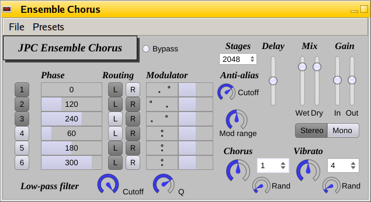

# JPC Ensemble Chorus
Digital model of electronic string ensemble chorus



**Experimental!**

This chorus effect simulates the operation of an analog circuit based on [Bucket-brigade delays (or BBD)](https://en.wikipedia.org/wiki/Bucket-brigade_device).

The BBD chorus was famously used in [ARP Solina](https://en.wikipedia.org/wiki/ARP_String_Ensemble) and [Eminent 310 Unique](https://en.wikipedia.org/wiki/Eminent_310_Unique) analog string ensemble synthesizers, and also in guitar effect pedals and other instruments. It is the chorus which gives these electronic instruments the timbral characteristics which turn them effectively into ensembles.

**Principle:** the chorus consists of 3 to 6 BBD lines. It samples the signal on each delay line by applying a variation on the delay, using pairs of low-frequency oscillators which are generated using fixed phase offsets from one to another.
Each LFO pair is made of one slower modulator, *Chorus*, and one faster modulator, *Vibrato*.

The BBD delay is an integrated circuit which implements an analog buffer using an array of capacitors, which maintains a memory of the signal. As the capacitors discharge between two sampling periods, the signal is degraded, and a distortion effect happens.

This chorus effect models real BBD circuits, so it recreates the distortion effect. This software package does not have the ambition to faithfully reproduce the characteristics of any existing effect; it is offers customization to allow the creation a vast set of timbres.

## Sound demo

Listen to the biniou:

- [Original Sound](https://soundcloud.com/user-482248552/jpc-ensemble-chorus-demo)
- [Chorused Sound](https://soundcloud.com/user-482248552/ensemble-chorus-demo)

## Development builds

[](https://semaphoreci.com/jpcima/ensemble-chorus)

Find automatic builds of the development branch [here](http://jpcima.sdf1.org/software/development/EnsembleChorus/).

## Dependencies

- `git`
- `build-essential`
- `cmake`
- `fluid`
- `libfltk1.3-dev`
- `libasound2-dev`
- `libjack-jackd2-dev` or `libjack-dev` (for Jack 2 or Jack 1 respectively)
- `libpulse-dev` (optional)
- `libfreetype6-dev`
- `libxrandr-dev`
- `libxinerama-dev`
- `libxcursor-dev`

## Build

```
git clone --recursive https://github.com/jpcima/ensemble-chorus.git
mkdir ensemble-chorus/build
cd ensemble-chorus/build
cmake -DCMAKE_BUILD_TYPE=Release ..
cmake --build .
```

## References

Raffel, C., & Smith, J. (2010, September)  
[Practical modeling of bucket-brigade device circuits](http://colinraffel.com/publications/dafx2010practical.pdf)

Jurgen Haible (2007)  
[JH. String Ensemble / Triple Chorus - "Solina"(TM) Emulator](http://jhaible.com/legacy/triple_chorus/triple_chorus.html)
